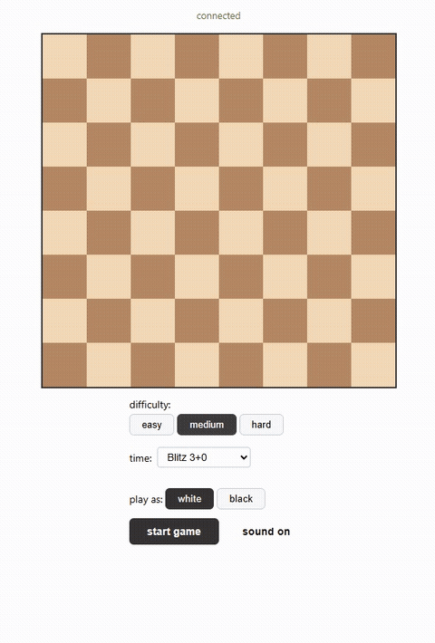
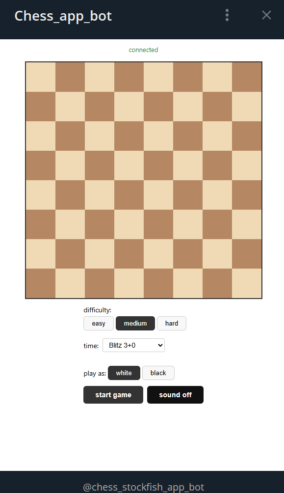
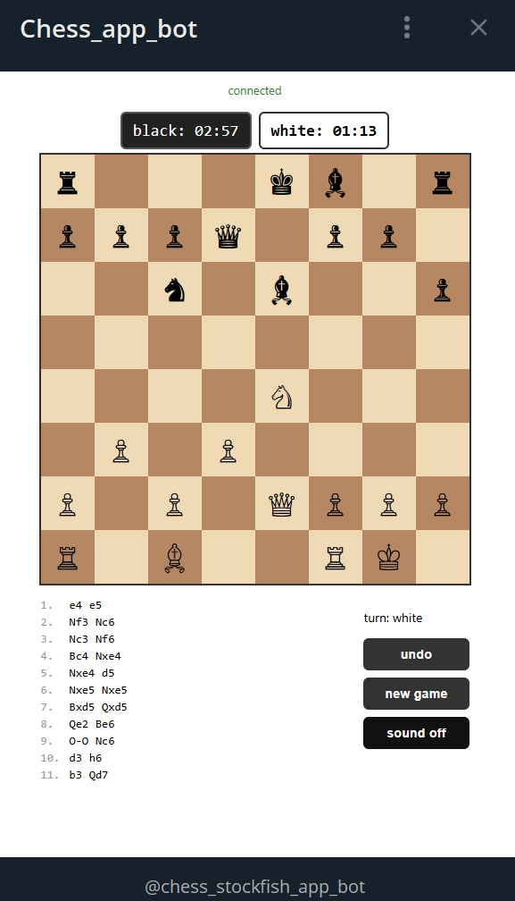
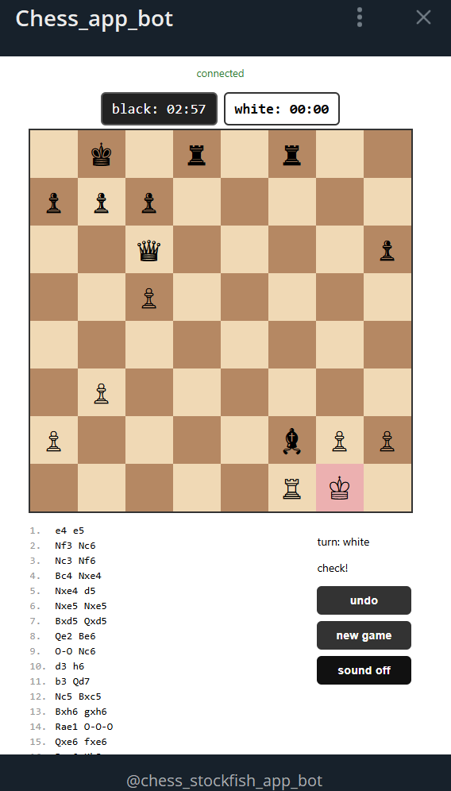
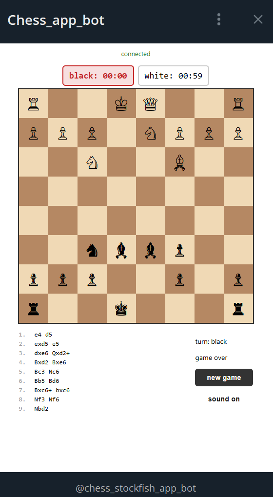
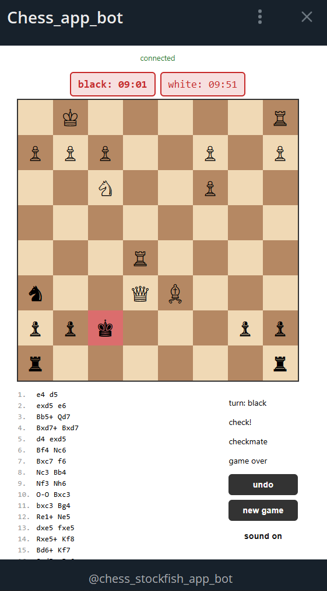

<div align="center">

[English](README.md) · [Русский](README_RU.md)

# Chess + Stockfish

**Play against Stockfish directly inside Telegram Mini Apps.**

[Demo](#live-demo) · [Features](#features) · [Architecture](#architecture) · [Installation](#installation) · [Roadmap](#roadmap)

[](LICENSE)


</div>



## Why This Project?

> Built to explore WebSocket architecture, server-authoritative chess logic and Telegram Mini Apps integration.

## Live Demo

The app runs as a [Telegram Mini App](https://core.telegram.org/bots/webapps). To try it:

1. Start a tunnel: `npx ngrok http 5173`
2. [@BotFather](https://t.me/BotFather) → your bot → Bot Settings → Menu Button → paste the tunnel URL
3. Open the bot in Telegram and tap the menu button

## Screenshots

| | |
|---|---|
|  |  |
|  |  |
|  | |

## Features

- Play vs Stockfish with **Easy / Medium / Hard** difficulty
- Time controls: **Bullet** (1+0), **Blitz** (3+0), **Rapid** (5+3), **Classic** (15+10)
- Chess clocks (100 ms server tick, increment on each move)
- **Undo** move (preserves full move history)
- Legal move highlights — white dots for empty squares, red outline for captures
- Board flip when playing black
- Sound effects (move, capture, check, checkmate) with on/off toggle
- Telegram Mini App theming (adapts to Telegram color scheme)
- Check and checkmate visual feedback (king square highlight)

## Architecture

```
┌─ Client (Vite + React) ──────────────────────┐
│  Board, ClockDisplay, GameInfo, MoveHistory   │
│  socket.io-client  ⇄  websocket               │
└───────────────────────────────────────────────┘
                      ↕
┌─ Server (Node.js + Express + Socket.IO) ──────┐
│  GameRoom (chess.js state + clocks + timer)   │
│  StockfishEngine (UCI via child_process)      │
│  Telegram initData HMAC auth middleware        │
└───────────────────────────────────────────────┘
```

- **Server chess.js** is the single source of truth for all position validation and game logic.
- **Client chess.js** is used only for legal-move display and board rendering.
- **Stockfish** runs as a child process per game, capped by `MAX_ENGINES` (default 4). Communication via UCI protocol over stdin/stdout.
- **Clocks** are decremented server-side every 100 ms and broadcast to the client.

## Tech Stack

| Layer | Technology |
|---|---|
| Backend | Node.js, Express, Socket.IO, chess.js |
| Frontend | Vite, React, socket.io-client, chess.js, @telegram-apps/sdk |
| Engine | Stockfish (UCI, per-game child_process) |
| Auth | Telegram initData HMAC-SHA256 (optional, skipped without TELEGRAM_BOT_TOKEN) |

## How It Works

1. Player selects **color**, **difficulty**, and **time control** → clicks *Start Game*.
2. Server creates a `GameRoom` with a fresh `chess.js` instance and launches a Stockfish process.
3. If it's Stockfish's turn, the server sends the current FEN via UCI, parses `bestmove`, and applies it.
4. Both player and Stockfish moves are validated server-side and broadcast to the client via Socket.IO.
5. A server-side interval (100 ms) decrements the active clock, adds increment after each move, and sends `time_update` events.
6. On timeout, checkmate, or draw the game ends — clock display turns red.

## Installation

Clone the repo and install dependencies:

```bash
git clone https://github.com/DVR-Claw-Aist/Chess-Stockfish-Base.git
cd Chess-Stockfish-Base
npm install
```

Place the Stockfish binary at `server/bin/stockfish/stockfish-windows-x86-64-sse41-popcnt.exe` (or adjust the path in `stockfish.js`).

Create `server/.env` (copy from `server/.env.example`):

```
PORT=3000
CLIENT_ORIGIN=http://localhost:5173
TELEGRAM_BOT_TOKEN=your_bot_token  # optional — auth is skipped if empty
MAX_ENGINES=4                      # max concurrent Stockfish processes
```

Run both server and client:

```bash
npm run dev
```

| Command | Description |
|---|---|
| `npm run dev` | Server + client (concurrently) |
| `npm start` | Server only |
| `npm run dev:server` | Server only (--watch) |
| `npm run dev:client` | Client only (Vite) |
| `npm test --workspace=server` | Engine smoke test (needs Stockfish binary) |

## Tests

`server/test/engine.test.mjs` starts a Stockfish process and requests a best move from the starting position. Requires the binary at `server/bin/stockfish/` (see Installation).

## Roadmap

- [ ] Position evaluation bar
- [ ] Move list with standard algebraic notation
- [ ] PGN export / import
- [ ] Takeback and draw offers
- [ ] Multiplayer (human vs human)
- [ ] i18n (EN / RU)

## License

Released under the [GNU General Public License v3.0](LICENSE).

The bundled [Stockfish](server/bin/stockfish/) engine is distributed under the GPL-3.0 license (see `server/bin/stockfish/Copying.txt`).
